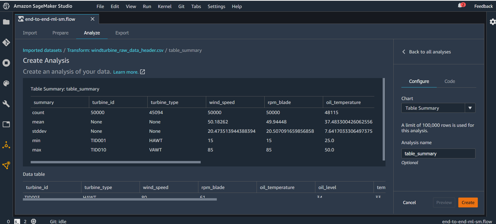

# Data exploration and feature engineering using Amazon SageMaker Data Wrangler
>**Please Note:** This module must be executed from the serverless notebook environment provided by Amazon SageMaker Studio; please check <a href="../01_configure_sagemaker_studio/">Module 01</a> for additional information.

In this section we will clean and prepare the data set for the training steps. This includes:
1. handling missing values
1. removing outliers
1. replacing categorical variables with one-hot-encodings
1. splitting the data set in train and test data
1. saving for the next steps

## Data Exploration
A great starting point for the data exploration is the **Table Summary** which can be found in the _Analyses_ section of a flow. 

To create a new analysis press the plus button in the flow diagram and select _Add anlysis_. Then select _Table Summary_ as the chart and press preview to see the results.

    
    

Optionally, press *Create* if you want to add this analysis to the flow.

We can draw the following conclusions from the values of the table summary:
- *turbine_type* and *oil_temperature* have missing values (a count less than 50000)
- *turbine_id*, *turbine_type*, *wind_direction*, and *breakdown* have non-numerical values and need preprocessing
- [**ToDo**] *xyz* has outliers ()

## Data Preprocessing
To perform the various preprocessing steps we can use a *Transform*. To add a new transform press the plus button in the flow diagram and select *Add transform*. Data Wrangler comes with most common transforms out-of-the box but you can also create custom transforms. 
### Handle Missing Values
For the missing values we can directly select *Handle missing* from the list of transforms.

Data Wrangler provides four ways to handle missing values including filling with a defined value or droping the row.

We will use *Impute* to let Data Wrangler automatically fill with an estimated value. 
For column *turbine_type* we will use column type *Categorical* and for *oil_temperature* we will use *Numeric*. 
To perform the transform, first press *Preview* and then *Add*.

### Remove Outliers 
[**ToDo**]

### Replace Categorical Values with One-Hot-Encodings
Like for missing data Data Wrangler provides a transform for one-hot-encoding called *Encode categorical*. 
Select it from the list of transforms and configure it. Again, pressing *Preview* shows a preview of the new one-hot encoded columns and pressing *Add* performs the transform and replaces the original column.

### Split Training and Test Data
[**ToDo**: Still unclear how to perform via Data Wrangler]

## Optional: Export Data Flow
To reuse your cleaning and preprocessing steps in future processing jobs Data Wrangler allows you to export your data flow, or selected steps of your flow, as python code or as jupyter notebook with the steps to create either a Data Wrangler job, Pipeline, or Feature Store feature based on the data flow.
To export change to the *Export* tab, mark all steps to be exported in the flow diagram and press *Export step*.

    

